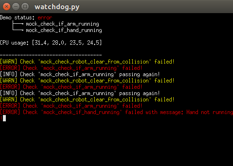

# sr_utilities_common
This package contains resources commonly used in another Shadow Robot's packages and repositories

## Shutdown handler
A custom handler for SIGINT signal (ctrl + C) executing a chosen class method apon node shutdown. It's advantage over [rospy.on_shutdown](http://wiki.ros.org/rospy/Overview/Initialization%20and%20Shutdown#Registering_shutdown_hooks) is that it allows using publishers at the shutdown stage. 

Example usage:
```python
class ExampleClass():
    self.__init__():
        self.example_variable

    def example_loop_method():
        while not rospy.is_shutdown():
            rospy.loginfo("Doing some stuff!")

    def clean_up():
        rospy.loginfo("Cleaning up!")

if __name__ == '__main__':
    rospy.init_node('example_node', anonymous=True)

    example_class = ExampleClass()
    shutdown_handler = ShutdownHandler(example_class, 'clean_up()')
    example_class.example_loop_method()

```

The above code will be executing an infinite loop until shutdown for the node is initiated. Then, before the node dies, the `clean_up` method will be executed. 

## Watchdog
A watchdog class that continuously runs specified check methods and informs the user about any undesired behaviours.

<p align="center">
    
</p>

An example of how to properly use the class can be seen in the code snipper below:
```python
#!/usr/bin/python

import rospy
from sr_utilities_common.shutdown_handler import ShutdownHandler
from sr_utilities_common.watchdog import SrWatchdog

class TestChecksClass(object):
    def __init__(self):
        self.tmp = [0, 0, 0]

    def mock_check_robot_clear_from_collision(self):
        rospy.sleep(4)
        if self.tmp[0] != 1:
            self.tmp[0] = 1
            return False
        else:
            self.tmp[0] = 0
            return True

    def mock_check_if_arm_running(self):
        rospy.sleep(5)
        if self.tmp[1] != 0:
            self.tmp[1] = 0
            return (False, "Something went wrong!")
        else:
            self.tmp[1] = 1
            return True


if __name__ == '__main__':
    rospy.init_node('mock_sr_teleop_watchdog')

    test_class = TestChecksClass()
    error_checks_list = ['mock_check_if_arm_running']
    warning_checks_list = ['mock_check_robot_clear_from_collision']

    teleop_watchdog = SrWatchdog(test_class, error_checks_list, warning_checks_list)
    shutdown_handler = ShutdownHandler(teleop_watchdog, 'clean_up()')
    teleop_watchdog.run()
    rospy.spin()
```

All the check methods are defined in a separate class. There are two types of checks supported. Error checks, which will change general status to `error` and throw an error message, and warning checks, which do not affect the reported status but inform the user that something has happened. In order to classify a check as error or warning check, their method name needs to be put in a proper list that is further passed to the `SrWatchdog` class constructor, together with the checks class object.

The check methods are required to return either `True` (for passed check) or `False` (for failed check) values. Alternatively, in case of failure, error checks can return a tuple of `(False, <error message>)` where `<error message>` is additional, user-defined error message.

In the code snippet above, a `ShutdownHandler` is defined as well in order to clean up console display changes performed by the watchdog class. This step is desired, but not necessary.

It is recommended to run the watchdog in a separate xterm window, as used in this [launch file](./launch/mock_watchdog.launch). This launch file can also be used as a reference to how the watchdog class works.