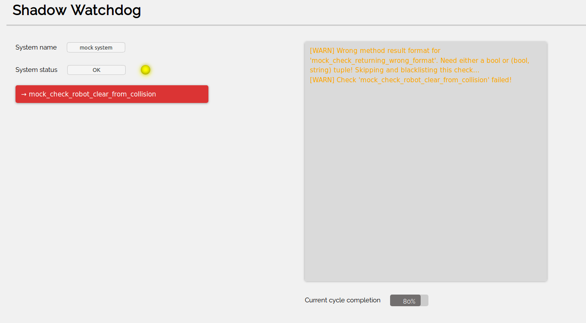

# Watchdog
A watchdog class that continuously runs specified check methods and informs the user about any undesired behaviours.

<p align="center">
  
</p>

An example of how to properly use the class can be seen in the code snipper below:
```python
import rospy
from sr_watchdog.watchdog import SrWatchdog, SrWatchdogChecks

class TestChecksClass(SrWatchdogChecks):
    def __init__(self):
        SrWatchdogChecks.__init__(self, "default")
        self.tmp = [0, 0, 0]

    @SrWatchdogChecks.watchdog_warning_check
    def mock_check_robot_clear_from_collision(self):
        rospy.sleep(6)
        if self.tmp[0] != 1:
            self.tmp[0] = 1
            return False
        else:
            self.tmp[0] = 0
            return True

    @SrWatchdogChecks.watchdog_error_check
    def mock_check_if_arm_running(self):
        rospy.sleep(10)
        if self.tmp[1] != 0:
            self.tmp[1] = 0
            return False
        else:
            self.tmp[1] = 1
            return True

if __name__ == '__main__':
    rospy.init_node('mock_sr_teleop_watchdog')

    test_class = TestChecksClass()
    mock_watchdog = SrWatchdog("mock system", [test_class])
    mock_watchdog.run()
    rospy.spin()
```

All the check methods are defined in a separate class. There are two types of checks supported. Error checks, which will change general status to `error` and throw an error message, and warning checks, which do not affect the reported status but inform the user that something has happened. In order to classify a method as a watchdog check a `@SrWatchdogChecks.<decorator name>` decorator must be used, where `<decorator_name>` is either `watchdog_error_check` or `watchdog_warning_check`, which specify whether a check is of an `error` or `warn` type. In order for a class to be handled by a watchdog, a `SrWatchdog` object needs to be created and the checks class passed to it as an argument. Multiple classes can be parsed simultaneously by the watchdog, therefore a list of classes (even if only one is used) need to by passed to the constructor.

If all checks pass, the watchdog reports the `OK` status for the demo. This status is maintained every iteration of the checking cycle if the checks keep passing. In any iteration, if one of the error checks fails, the status of the demo will be changed to `Error` and the led light will turn red. If a warning check fails, the `OK` status will be maintained, however, led will turn yellow. All failing checks will be displayed in the red textbox below the status label. Finally, if any of the checks starts passing again, it will be removed from the box and if all error checks start passing again, demo status will go back to `OK`.

The check methods are required to return either `True` (for passed check) or `False` (for failed check) values. Alternatively, in case of failure, error checks can return a tuple of `(False, <error message>)` where `<error message>` is additional, user-defined error message.

By default, the watchdog class publishes result to the `sr_watchdog` topic. However, a GUI is available to visualize the system status and logs. In order to run the GUI, after starting your watchdog, run

```sh
roslaunch sr_watchdog watchdog_web_gui.launch
```

and in the browser of your choice go to

```sh
localhost:8080
```

An example, mock watchdog has been implemented [here](./scripts/mock_watchdog.py) and can be run, together with the GUI using [this launch file](./launch/mock_watchdog.launch).